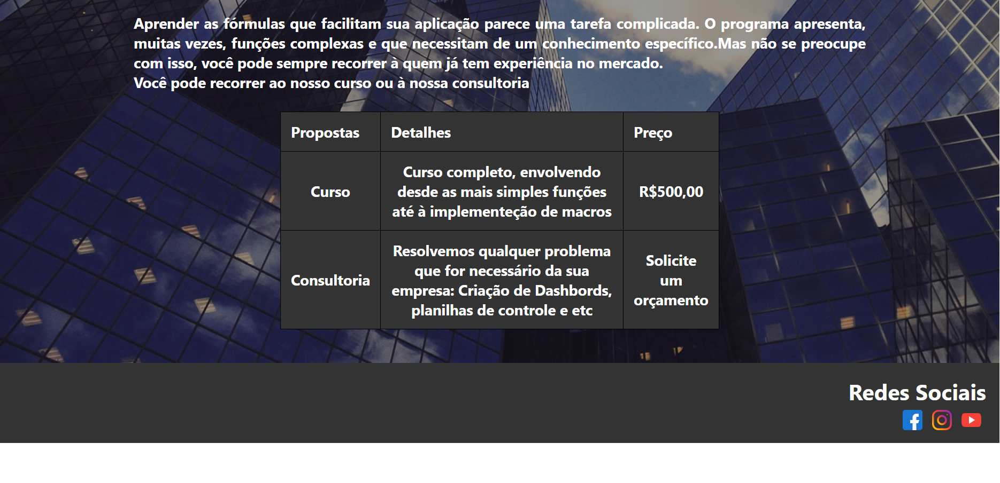
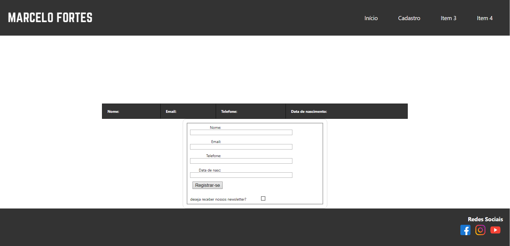
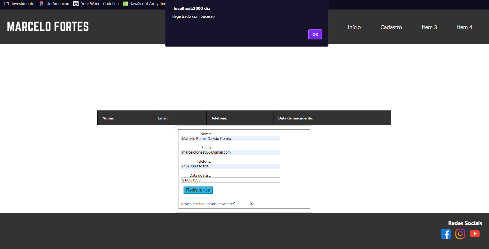

<h1>Prova-dia-13-12-2020</h1 style="text-align: center">

<h1>Screenshots</h1>

<h2>Landing Page</h2>
 
 
 
<h2>Cadastro</h2>
 
 
 
 
<h1>Requisitos Prova</h1>
1)	Crie um projeto em React Js com um dos temas listados abaixo, que contenha a seguinte estrutura de componentes: 
    <h3>a)	Temas:</h3>
      <ol>
        <li>LandingPage de um produto ou serviço;</li>
        <li>LandingPage de um curso;</li>
        <li>LandingPage de uma tecnologia;</li>
        <li>LandingPage de uma banda ou um artista;</li>
        <li>LandingPage de um jogo/guilda;</li>
      </ol>
    <h3>b)	Requisitos:</h3>
    <li>i)	Uma página LandingPage com os seguintes componentes:</li>
    <ol>
      <li>Header com cor de fundo, que contenha um Menu com 4 itens à direita e uma Logo à esquerda;</li>
      <li>Uma imagem de fundo de no mínimo 500px de altura, com texto centralizado horizontalmente e verticalmente, logo abaixo do Header;</li>
      <li>Uma lista em formato de tabela dos diferenciais do produto/ tecnologia ou tópicos do tema escolhido. Essa lista deve ser consumida de um arquivo json;</li>
      <li>Footer com redes sociais e contatos.</li>
    </ol>
    <li>ii)	Uma página de Erro, que importe o mesmo Header e o Footer da página anterior, mas que contenha uma mensagem de erro no centro da página, para o caso do usuário digitar uma rota inválida;</li>
    <li>iii) Gestão de rotas com o react-router-dom.</li>
    <li>iv)	Uma página com o mesmo Header e Footer das demais com um cadastro de pessoa interessada em receber uma amostra do produto, curso ou tecnologia, ou mais informações                 relacionadas ao tema escolhido, com os campos: </li>
    <ol>
      <li>Nome, </li>
      <li>E-mail, </li>
      <li>Telefone,</li>
      <li>Data de nascimento,</li>
      <li>Checkbox de aceitar receber newsletter.</li>
    </ol>
    <li>Ao clicar no botão de submit deve ser exibido no console o objeto com os dados do formulário.</li>
    <li>v)	Utilizar renderização condicional para apresentar componentes distintos de acordo com a situação;</li>
